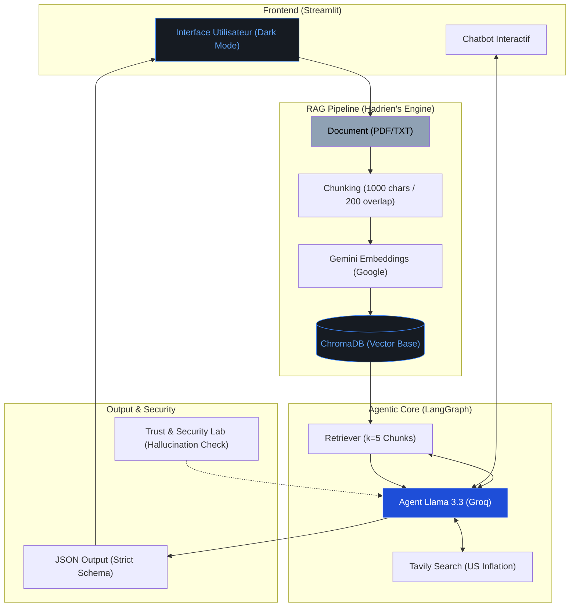

# Architecture Technique : Contracta.ai

Voici le code pour générer ton diagramme d'architecture. Tu peux le copier-coller sur [Mermaid.live](https://mermaid.live/) pour obtenir une image haute définition pour tes slides.

## Explications techniques pour tes slides :
1.  **Ingestion (RAG) :** Les documents sont découpés en blocs de 1000 caractères avec un chevauchement de 20%. C'est crucial pour ne pas couper une clause juridique au milieu.
2.  **Stockage :** ChromaDB permet de retrouver les 5 paragraphes les plus pertinents (Similarity Search) pour répondre à une question précise.
3.  **Agent :** L'agent n'est pas passif. Il décide d'utiliser Tavily pour vérifier l'inflation US réelle avant de rendre son verdict.
4.  **Interface :** Streamlit gère le rendu en temps réel et la mémoire de la conversation (Chatbot).
